# Scheme LLM Toolkit Architecture

This document provides a comprehensive overview of the Scheme LLM Toolkit's architecture, including control flow, data flow, and sequence diagrams.

## Table of Contents

1. [System Overview](#system-overview)
2. [Architecture Components](#architecture-components)
3. [Control Flow](#control-flow)
4. [Data Flow](#data-flow)
5. [Sequence Diagrams](#sequence-diagrams)
6. [Module Structure](#module-structure)

## System Overview

The Scheme LLM Toolkit provides a functional interface for integrating Large Language Models into Guile Scheme applications. It follows a modular, provider-agnostic design that emphasizes composability and type safety.

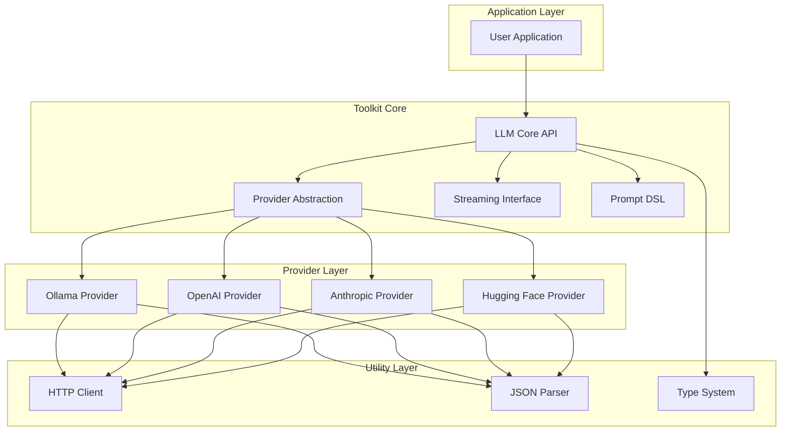

## Architecture Components

### Core Components

1. **LLM Core API** (`llm/core/`)
   - Central interface for all LLM operations
   - Manages provider selection and routing
   - Handles response normalization

2. **Provider Abstraction** (`llm/providers/`)
   - Defines common interface for all providers
   - Implements provider-specific logic
   - Manages authentication and configuration

3. **Streaming Interface**
   - Functional streaming for real-time responses
   - Event-based callbacks for token processing
   - Backpressure handling

4. **Prompt DSL**
   - S-expression based prompt construction
   - Composable prompt templates
   - Type-safe parameter injection

### Provider Implementations

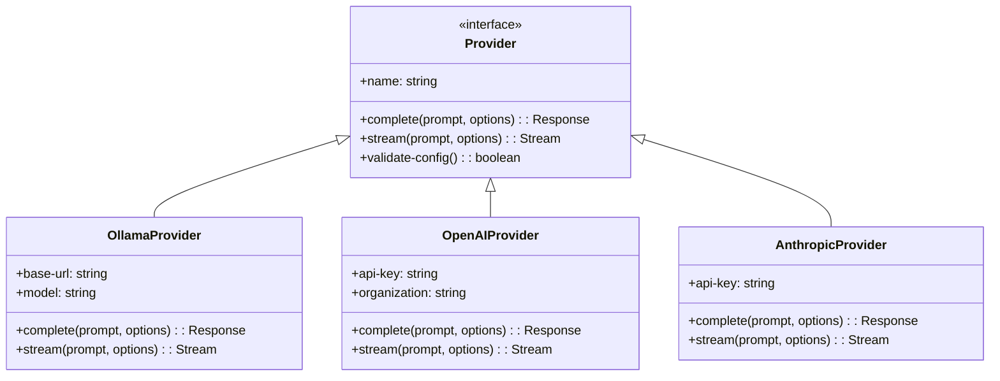

## Control Flow

### Request Processing Flow

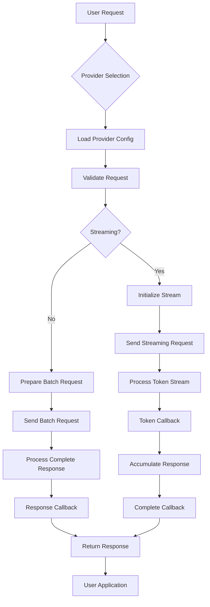

### Error Handling Flow

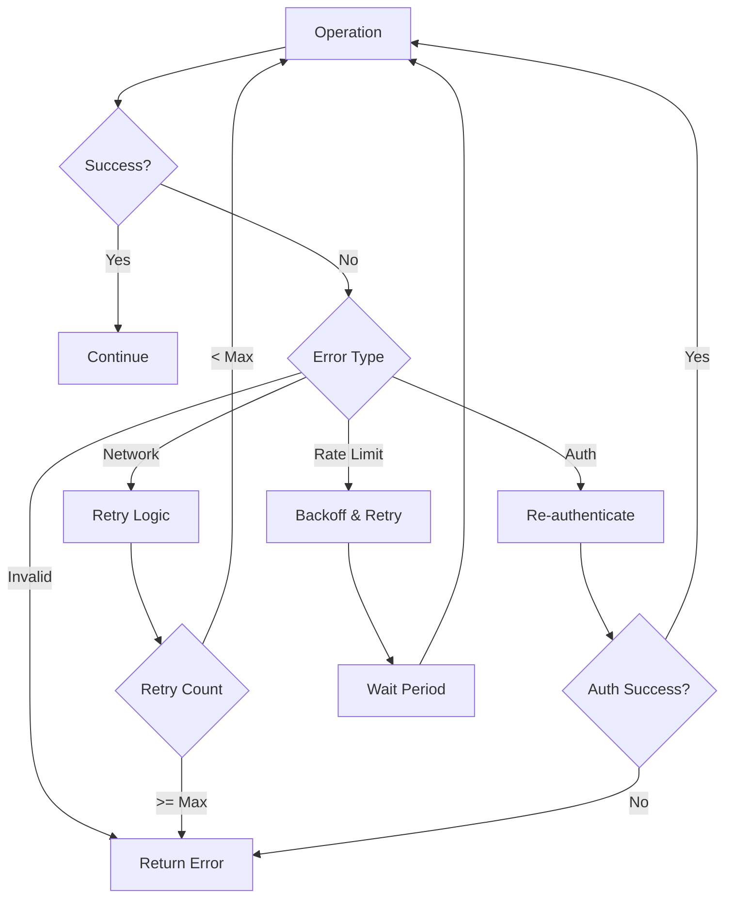

## Data Flow

### Request/Response Data Flow

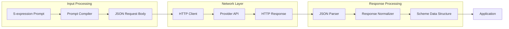

### Configuration Data Flow

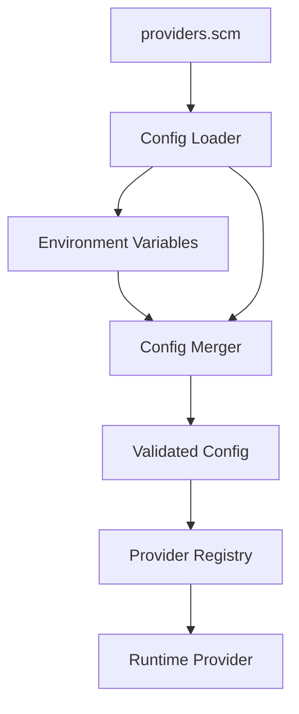

## Sequence Diagrams

### Basic Completion Request

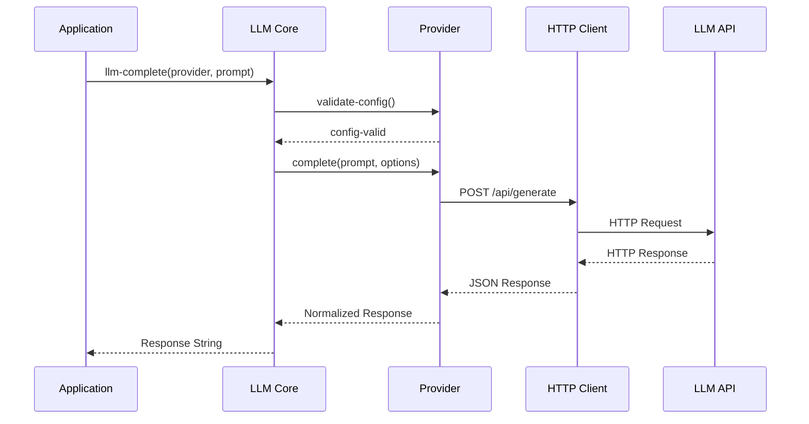

### Streaming Request

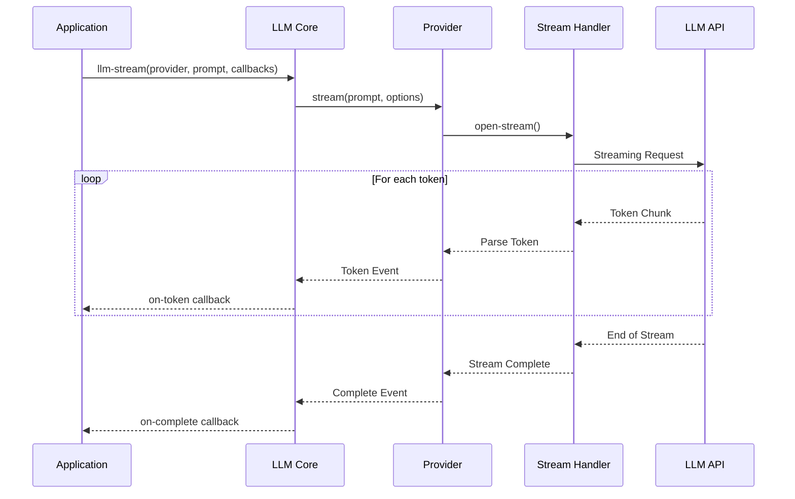

### Multi-Provider Request

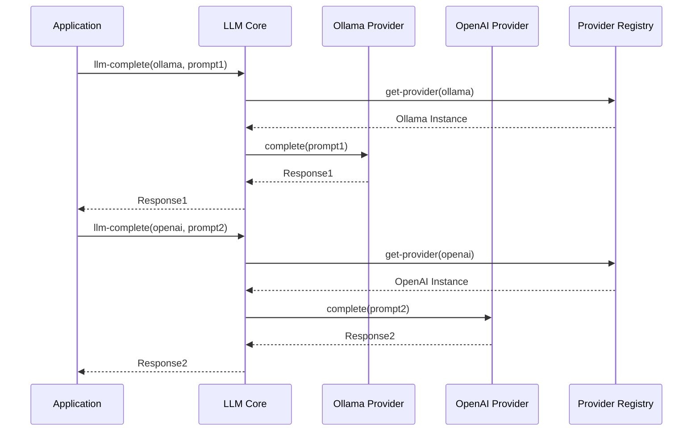

## Module Structure

### Dependency Graph

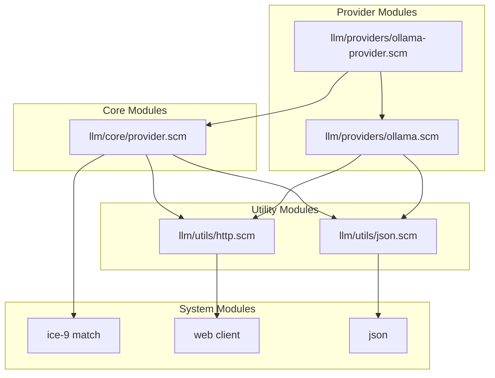

### Module Interfaces

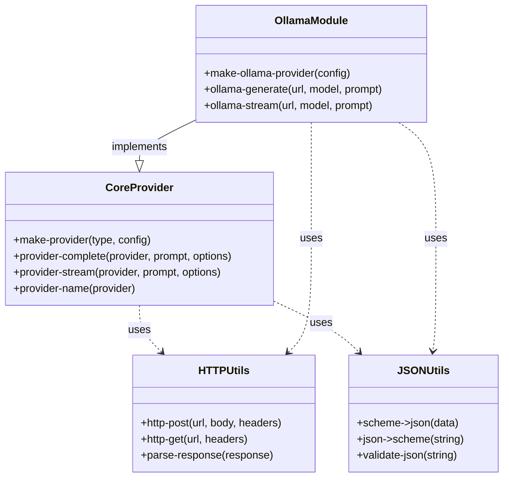

## Design Principles

1. **Functional Composition**: All operations are pure functions that can be composed
2. **Provider Agnostic**: Core logic is independent of specific LLM providers
3. **Type Safety**: Strong typing through Scheme's type system and contracts
4. **Streaming First**: Designed for real-time streaming with fallback to batch
5. **Error Recovery**: Comprehensive error handling with retry mechanisms
6. **Configuration Driven**: External configuration for all provider settings

## Future Architecture Considerations

1. **Caching Layer**: Add response caching for identical prompts
2. **Load Balancing**: Distribute requests across multiple provider instances
3. **Metrics Collection**: Built-in telemetry for monitoring and debugging
4. **Plugin System**: Dynamic provider loading without core modifications
5. **Vector Store Integration**: Support for RAG (Retrieval Augmented Generation)

---

This architecture ensures the Scheme LLM Toolkit remains flexible, maintainable, and extensible while providing a clean functional interface for Scheme applications.